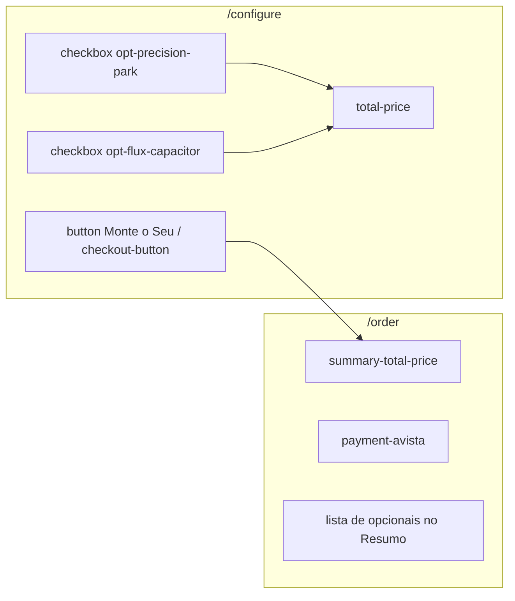

# Plano: Automação CT03 com Playwright

## Contexto do cenário

O [CT03](docs/tests/testcases.md) valida 4 passos encadeados:

| Passo | Ação | Preço esperado |
|-------|------|----------------|
| 1 | Marcar **Precision Park** | R$ 45.500,00 (+R$ 5.500) |
| 2 | Marcar **Flux Capacitor** | R$ 50.500,00 (+R$ 5.000) |
| 3 | Desmarcar ambos | R$ 40.000,00 |
| 4 | Clicar **Monte o Seu** | Redireciona para `/order` com config persistida |

O [desafio-2](docs/desafios/desafio-2) exige: explorar com MCP primeiro, implementar o teste, executar até passar, e refatorar com **Feature Actions** reutilizando [`configuratorActions.ts`](playwright/support/actions/configuratorActions.ts).

## Mapeamento UI (código-fonte)

Elementos relevantes já identificados em [`ConfigPanel.tsx`](src/components/configurator/ConfigPanel.tsx) e [`Order.tsx`](src/pages/Order.tsx):



- Preços calculados em [`configuratorStore.ts`](src/store/configuratorStore.ts): base `40000`, Precision Park `5500`, Flux Capacitor `5000`.
- Estado persiste via Zustand (`localStorage` key: `velo-configurator-storage`).
- Padrão existente do CT02: fixture `app.configurator.*`, constantes de preço formatadas, `beforeEach` com `open()`.

## Fase 1 — Exploração manual com Playwright MCP (obrigatória)

Antes de escrever código, executar **cada passo do CT03** via MCP (`browser_navigate`, `browser_click`, `browser_snapshot`):

1. Navegar para `http://localhost:5173/configure` (app rodando com `yarn dev`).
2. Snapshot inicial: confirmar preço `R$ 40.000,00` em `[data-testid="total-price"]` e seção `[data-testid="section-opcionais"]`.
3. Clicar no checkbox **Precision Park** — validar preço `R$ 45.500,00`.
4. Clicar no checkbox **Flux Capacitor** — validar preço `R$ 50.500,00`.
5. Desmarcar ambos — validar retorno a `R$ 40.000,00`.
6. Clicar **Monte o Seu** — validar URL `/order`, heading "Finalizar Pedido", `[data-testid="summary-total-price"]` com `R$ 40.000,00`, e ausência de opcionais no bloco "Resumo".

**Localizadores a confirmar no snapshot:**

| Elemento | Preferência (prompt QA) | Fallback estável no app |
|----------|----------------------|-------------------------|
| Checkbox Precision Park | `getByRole('checkbox', { name: /Precision Park/i })` | `getByTestId('opt-precision-park')` |
| Checkbox Flux Capacitor | `getByRole('checkbox', { name: /Flux Capacitor/i })` | `getByTestId('opt-flux-capacitor')` |
| Preço configurador | — | `getByTestId('total-price')` (já usado no CT02) |
| Botão checkout | `getByRole('button', { name: 'Monte o Seu' })` | `getByTestId('checkout-button')` |
| Total checkout | — | `getByTestId('summary-total-price')` |

Documentar qual estratégia funcionou para checkboxes Radix (nome acessível vs. testId).

## Fase 2 — Estender Feature Actions

Arquivo: [`playwright/support/actions/configuratorActions.ts`](playwright/support/actions/configuratorActions.ts)

**Novas constantes** (espelhando o store):

```typescript
export const PRECISION_PARK_PRICE = 'R$ 45.500,00'
export const BOTH_OPTIONALS_PRICE = 'R$ 50.500,00'
```

**Novo type:**

```typescript
export type OptionalFeature = 'precision-park' | 'flux-capacitor'
```

**Novos métodos** (tipados com `Page`/`expect` nativo):

| Método | Responsabilidade |
|--------|------------------|
| `resetStorage()` | Remove `velo-configurator-storage` e recarrega — garante isolamento entre testes |
| `toggleOptional(optional: OptionalFeature)` | Clica no checkbox do opcional |
| `expectOptionalChecked(optional, checked: boolean)` | `toBeChecked()` / `not.toBeChecked()` |
| `proceedToCheckout()` | Clica "Monte o Seu" + `expect(page).toHaveURL(/\/order/)` |
| `expectCheckoutPrice(price: string)` | Assert em `summary-total-price` |
| `expectCheckoutWithoutOptionals()` | Garante que "Precision Park" e "Flux Capacitor" não aparecem no Resumo |

**Ajuste em `open()`:***:* chamar `resetStorage()` internamente (ou no `beforeEach`) para evitar vazamento de estado do Zustand persist entre testes — requisito de independência do [prompt QA](docs/prompts/prompt-qa-playwright-automator.md).

Reutilizar `expectPrice()` existente para checkpoints nos passos 1–3.

## Fase 3 — Implementar o teste

Arquivo: [`playwright/e2e/configurator.spec.ts`](playwright/e2e/configurator.spec.ts)

Adicionar **um teste** no `test.describe('Configuração do Veículo')` existente, mantendo o mesmo `beforeEach`:

```typescript
test('deve atualizar o preço ao adicionar e remover opcionais e persistir a configuração no checkout', async ({ app }) => {
  // Checkpoint inicial
  await app.configurator.expectPrice(BASE_PRICE)

  // Passo 1
  await app.configurator.toggleOptional('precision-park')
  await app.configurator.expectPrice(PRECISION_PARK_PRICE)

  // Passo 2
  await app.configurator.toggleOptional('flux-capacitor')
  await app.configurator.expectPrice(BOTH_OPTIONALS_PRICE)

  // Passo 3
  await app.configurator.toggleOptional('precision-park')
  await app.configurator.toggleOptional('flux-capacitor')
  await app.configurator.expectPrice(BASE_PRICE)

  // Passo 4
  await app.configurator.proceedToCheckout()
  await app.configurator.expectCheckoutPrice(BASE_PRICE)
  await app.configurator.expectCheckoutWithoutOptionals()
})
```

Não criar arquivo separado — CT02 e CT03 compartilham o mesmo domínio e describe.

## Fase 4 — Execução e iteração

Pré-requisito: app em `http://localhost:5173` (`yarn dev`).

```bash
npx playwright test playwright/e2e/configurator.spec.ts --grep "opcionais"
```

Regras do prompt a respeitar na iteração:

- Asserções nativas Playwright com auto-retry (`expect`, `toBeVisible`, `toHaveText`, `toHaveURL`).
- Sem `waitForTimeout` ou timeouts customizados desnecessários.
- Checkpoint após cada ação crítica (toggle, navegação).

Se falhar por estado persistido, revisar `resetStorage()` no `open()`.

## Arquivos impactados

| Arquivo | Alteração |
|---------|-----------|
| [`playwright/support/actions/configuratorActions.ts`](playwright/support/actions/configuratorActions.ts) | Constantes, types e métodos de opcionais/checkout |
| [`playwright/e2e/configurator.spec.ts`](playwright/e2e/configurator.spec.ts) | Novo teste CT03 |
| [`playwright/support/fixtures.ts`](playwright/support/fixtures.ts) | Sem alteração (já expõe `app.configurator`) |

## Critérios de aceite (DoD)

- Teste passa de forma isolada e junto com os demais testes do `configurator.spec.ts`.
- Cobre os 4 passos do CT03 com checkpoints de preço em cada transição.
- Usa Feature Actions (sem lógica de interação inline no spec).
- Localizadores seguem hierarquia do prompt (`getByRole` onde possível; `getByTestId` alinhado ao padrão já adotado no CT02).
- Checkout confirma URL `/order`, total `R$ 40.000,00` e ausência de opcionais após desmarcar.

## Riscos e mitigações

| Risco | Mitigação |
|-------|-----------|
| Estado Zustand vaza entre testes | `resetStorage()` no `open()` |
| Checkbox Radix sem nome acessível | Validar no MCP; usar `getByTestId` como fallback documentado |
| Dev server offline | Garantir `yarn dev` antes de rodar testes (webServer no config está comentado) |
